# Responsive Product Landing Page - Pixelar Photobooth

## 1. Project Title
**Pixelar Photobooth - Modern Responsive Product Landing Page**  
*ITST 302: Client-Server Technologies (Week 5 Mini Project 04)*

---

## 2. Introduction
A product landing page serves as the primary digital storefront for modern businesses. It acts as the initial touchpoint for potential clients, playing a pivotal role in brand communication, user engagement, and conversion rates.

This project transforms the brand identity and physical offerings of **Pixelar Photobooth**—a modern photobooth rental service—into an interactive, professional web interface. Built with **Laravel**, **Tailwind CSS**, and **Blade Components**, this landing page demonstrates modular UI design, responsive layout execution, and efficient code organization.

---

## 3. Objectives
Upon completing this activity, the following objectives were accomplished:
* Built a fully responsive landing page optimized for desktop, tablet, and mobile devices.
* Developed reusable Laravel Blade Components to enforce DRY (Don't Repeat Yourself) code principles.
* Applied Tailwind CSS utility classes, Flexbox, and CSS Grid for layout structuring and styling.
* Documented frontend architecture and established clear visual hierarchy using modern design principles[cite: 3].
* Published a complete portfolio project with structured documentation and source code on GitHub[cite: 3].

---

## 4. Responsive Web Design
Responsive Web Design (RWD) ensures the web application delivers an optimal user experience across varying screen sizes[cite: 3].

* **Mobile-First Approach:** Layouts were crafted starting with base mobile styles and scaled up smoothly using Tailwind's responsive breakpoints (`md:`, `lg:`)[cite: 3].
* **Flexbox & CSS Grid:** Grid systems (`grid-cols-1`, `lg:grid-cols-12`) were utilized for complex sections like the Bento grid product showcase, while Flexbox managed content alignment in navigation bars and CTA containers[cite: 3].
* **UX Importance:** A responsive layout prevents layout breakage, maintains readability, reduces bounce rates, and ensures seamless booking flows for visitors on mobile devices[cite: 3].

---

## 5. Tailwind CSS
Tailwind CSS provides a utility-first workflow that eliminates the need for writing custom CSS classes while maintaining design consistency[cite: 3].

### Key Advantages:
* **Rapid Prototyping:** Direct utility styling accelerates development[cite: 3].
* **Design System Consistency:** Standardized spacing, colors, and typography scales[cite: 3].
* **Built-in Breakpoints:** Easily manage layouts per screen size using prefix classes[cite: 3].

### Code Example:
```blade
<div class="grid grid-cols-1 lg:grid-cols-12 gap-8 items-start">
    <div class="lg:col-span-7 bg-surface-container-lowest rounded-3xl p-6 lg:p-8 shadow-md">
        <!-- Reusable component rendering -->
    </div>
</div>

6. Blade Components
Blade Components enable modular UI development by breaking complex web pages into reusable elements[cite: 3]. This improves code maintainability, reduces duplication, and standardizes UI patterns across the application[cite: 3].

Component Code Example (product-showcase.blade.php):
Blade
@props([
    'strips' => [],
    'backdrops' => [],
])

<div class="grid grid-cols-2 sm:grid-cols-4 gap-4 pt-2">
    @foreach ($strips as $strip)
        <x-print-strip 
            :images="$strip['images'] ?? []" 
            :label="$strip['label'] ?? ''" 
            :caption="$strip['caption'] ?? ''" 
            :grayscale="$strip['grayscale'] ?? false" 
        />
    @endforeach
</div>
7. User Interface Design
The design system for Pixelar Photobooth emphasizes clarity, high contrast, and retro-modern aesthetics[cite: 3].

Color Palette: Deep dark surfaces combined with vibrant accent tones (bg-surface-container, text-primary) for high readability and visual depth[cite: 3].

Typography: Bold headline hierarchy combined with clean sans-serif body type for effortless scanning[cite: 3].

Iconography: Integrated Google Material Symbols for intuitive key metrics and visual cues[cite: 3].

Cards & Containers: Soft rounded corners (rounded-3xl, rounded-2xl) with subtle drop shadows (shadow-md) to define content hierarchy[cite: 3].

8. Folder Structure
The project repository follows standard Laravel frontend organization conventions[cite: 3]:

Plaintext
week05-product-landing-page/
├── app/
├── public/
│   └── images/
├── resources/
│   └── views/
│       ├── components/        # Reusable Blade components (navbar, hero, cards)
│       ├── layouts/           # Master Blade layout (app.blade.php)
│       └── pages/             # Landing page views
├── screenshots/               # Visual proof & section previews
└── README.md                  # Project documentation

## 9. Screenshots

### Before & After Transformation
| Initial Prototype (Before) | Final Refined Interface (After) |
| :---: | :---: |
| 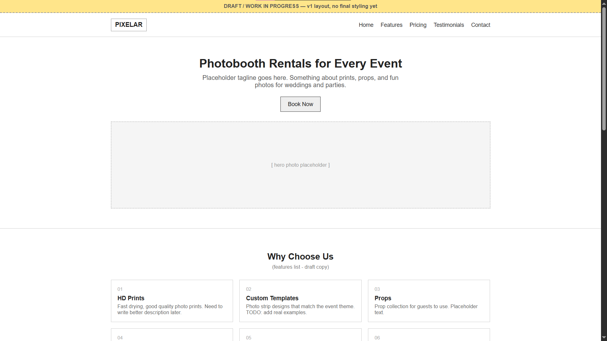 |  |

---

### Responsive Breakpoints
| Desktop View | Tablet View | Mobile View |
| :---: | :---: | :---: |
| 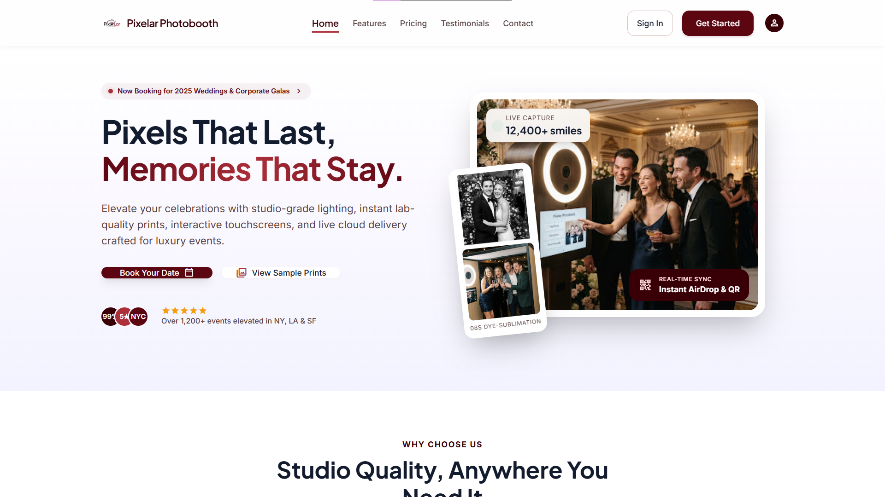 | 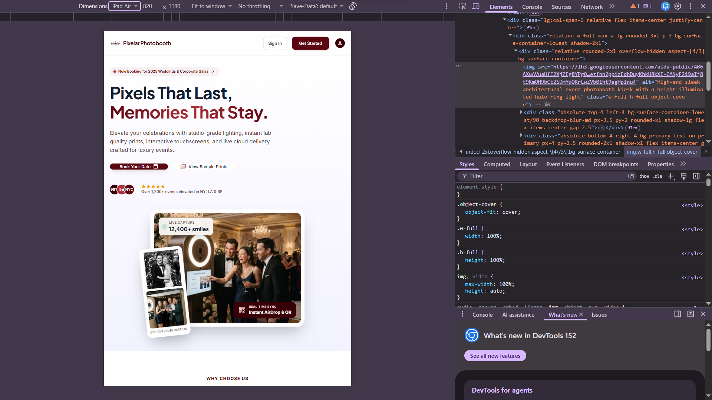 | 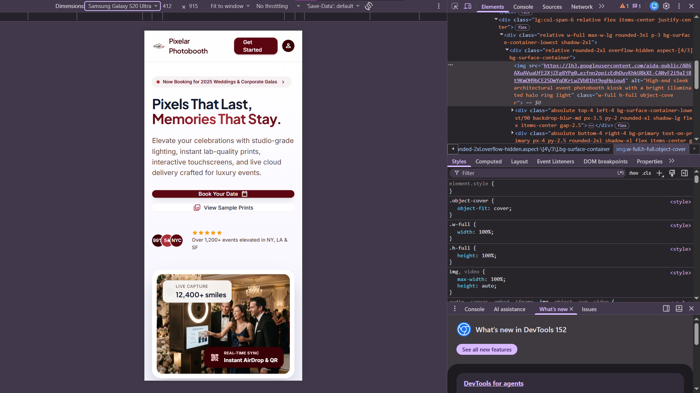 |

---

### Section Highlights
| Section | Screenshot |
| :--- | :--- |
| **Navigation Bar** |  |
| **Hero Section** | 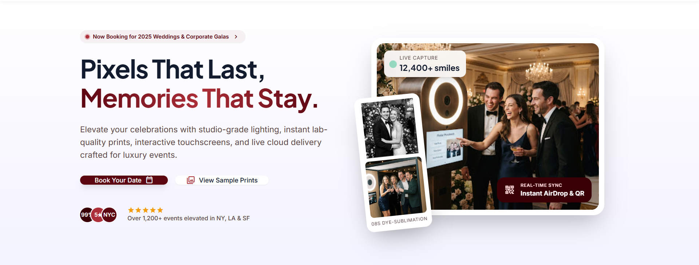 |
| **Features Section** | 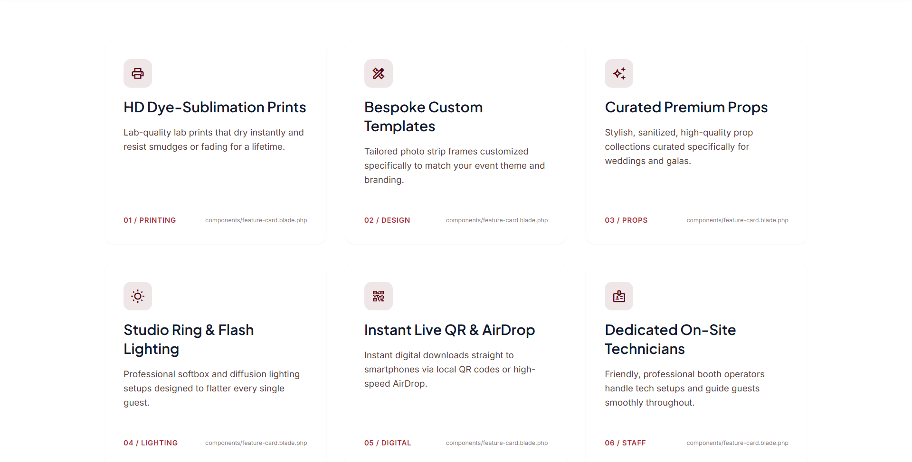 |
| **Pricing Section** | 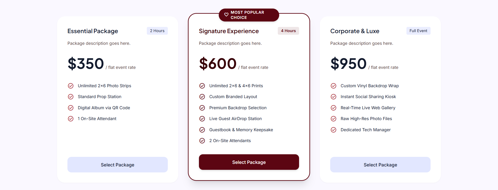 |
| **Testimonials** | 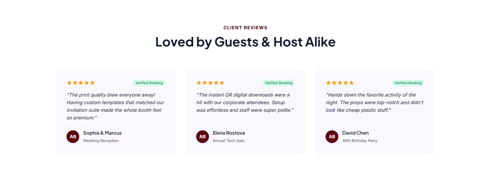 |
| **Footer** | 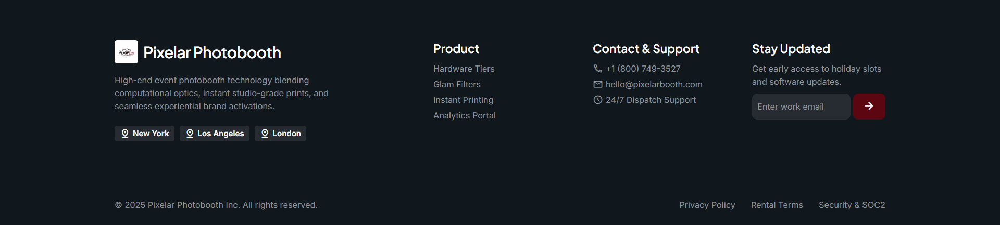 |

---

### Architecture & Codebase
| View Component Structure | VS Code Folder Tree |
| :---: | :---: |
| 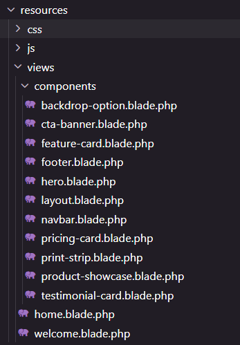 | 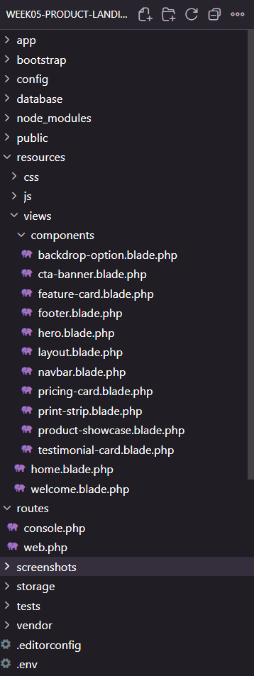 |

LinkedIN: https://lnkd.in/p/dsf8hKcS